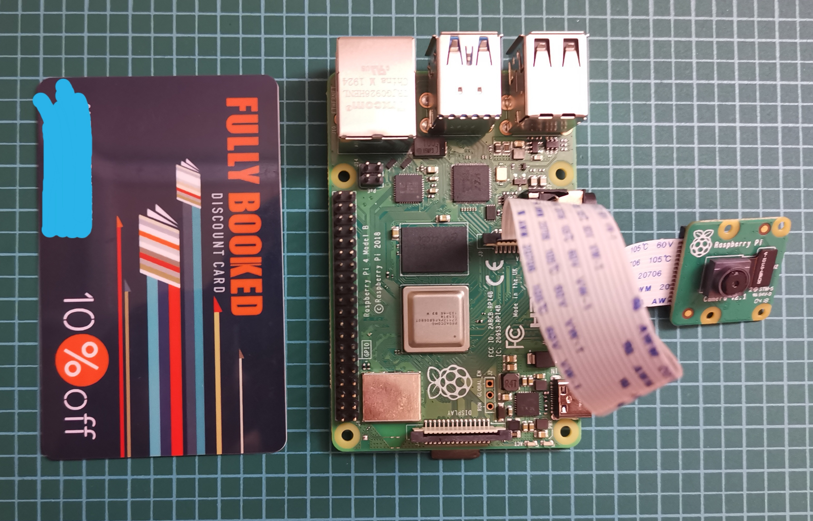

# rpi-cctv

1. Install rpi OS from here: https://www.raspberrypi.org/software/

2. Install RPI Web Cam Interface: https://elinux.org/RPi-Cam-Web-Interface

3. Install Real VNC: https://www.realvnc.com/en/raspberrypi/

